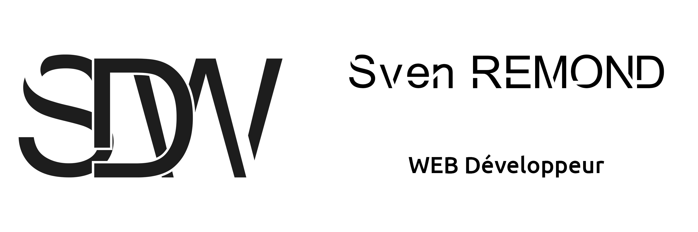

# 

<a target="_blank" href="https://www.sven-remond.fr"> &nbsp&nbsp&nbsp&nbsp

---

## Bonjour,

Je suis **passionné de technologie** en tout genre, je suis autant passionné par le **front** que par le **back**. J'aime joué au jeux vidéos et j'aimerais bien si l'occasion se présente en créer.

---

### :blue_book: J'ai des **connaissance** en :

- HTML
- CSS et SCSS
- JS
- PHP
- SQL
- Linux
- Interface réseaux

Mon ordinateur fixe :desktop_computer: est sous linux, mon ordinateur portable :computer: est sous windows.
J'aimerais bien faire du KVM sur mon fixe pour y acceuillir Linux et Windows.

### 📖 J'aimerais bien **apprendre** :

- L'animation de SVG
- La création de Jeux vidéos
- JAVA

J'ai quelque connaissance de blender, photoshop, indesign, premiere pro, after effect, illustrator.

---
